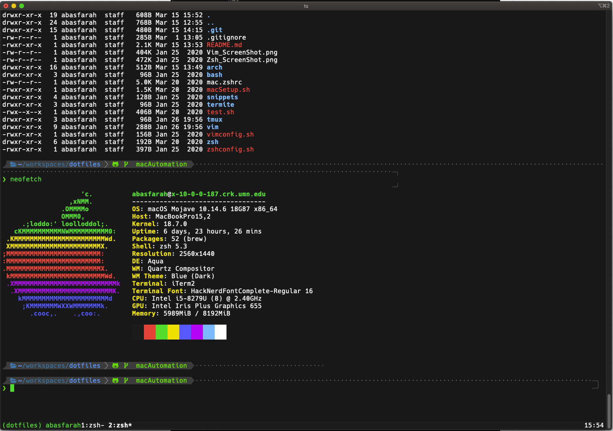

# Dot Files

#### Screenshot of Vim and TMUX setup


## Installation

To install run the following script
```bash
/bin/bash -c "$(curl -fsSL https://raw.githubusercontent.com/abasnfarah/dotfiles/main/install)"
```

### MacOS

This is the package list installed with Brew.
To change this list you can clone this repo and update `brew.sh` file.

```bash
packages=(
    bash 
    git 
    zsh 
    neofetch 
    tree 
    coreutils
    zsh-syntax-highlighting 
    npm 
    mvn 
    yarn 
    go 
    python3 
    fzf 
    romkatv/powerlevel10k/powerlevel10k
)
```

This is the Cask list installed with Brew.
To change this list you can clone this repo and update `brew.sh` file.

```bash

CASKS=(
    adobe-creative-cloud
    alfred
    anki
    binance
    discord
    disk-inventory-x
    docker
    expressvpn
    firefox
    google-chrome
    intellij-idea-ce
    iterm2
    kindle
    lastpass
    minecraft
    notion
    obs
    postman
    postico
    slack
    spotify
    steam
    tor-browser
    virtualbox
    visual-studio-code
    vlc
    zoom
)
```


### Arch Linux Install
If looking for a guide to install Arch w/ UEFI go to [Arch Install Guide](./arch/README.md)

## Vim and TMUX config

My vim config uses the following plugins

```vim

" Completion handler
Plug 'neoclide/coc.nvim', {'branch': 'release'}
"Plug 'neoclide/coc.nvim', { 'branch': 'master', 'do': 'yarn install --frozen-lockfile' }

" Go plugin for vim development
Plug 'fatih/vim-go', { 'do': ':GoUpdateBinaries' }

" File tree 
Plug 'scrooloose/nerdtree'
Plug 'tiagofumo/vim-nerdtree-syntax-highlight'

" Markdown Preview
Plug 'iamcco/markdown-preview.nvim' 

" git integration
Plug 'Xuyuanp/nerdtree-git-plugin'
Plug 'airblade/vim-gitgutter'

" Themes and icons
Plug 'ryanoasis/vim-devicons'
Plug 'flazz/vim-colorschemes'
Plug 'vim-airline/vim-airline'
Plug 'vim-airline/vim-airline-themes'
Plug 'morhetz/gruvbox'
Plug 'HerringtonDarkholme/yats.vim' " TS Syntax
Plug 'sonph/onehalf', { 'rtp': 'vim' }
Plug 'vim-python/python-syntax'
Plug 'yuezk/vim-js'
Plug 'maxmellon/vim-jsx-pretty'
Plug 'styled-components/vim-styled-components', { 'branch': 'main' }
Plug 'jparise/vim-graphql'


" fuzzy file finder
Plug 'ctrlpvim/ctrlp.vim' 

" Commenter 
Plug 'preservim/nerdcommenter'

" JSX
"Plug 'prettier/vim-prettier', { 'do': 'yarn install' }

" Tmux and vim integration
Plug 'christoomey/vim-tmux-navigator'


```


### Requirements 
1. vim
To install vim on arch run 
`sudo pacman -S vim`
or install on mac using [homebrew](https://brew.sh/)
`brew install vim`

 
## Zsh configuration
My zsh config uses oh-my-zsh themes and built in commands namely for git and tmux

### Requirements:
1. zsh, git, curl and wget
To install on arch run
`sudo pacman -S zsh wget curl git`
to install on mac using [homebrew](https://brew.sh/) run 
`brew install zsh curl wget`
2. mac or arch linux machine
3. Change primary shell to zsh
To change primary shell to zsh run
`chsh -s $(which zsh)`

#### ScreenShot of zsh setup


To run enter `. ~/dotfiles/zshconfig.sh` on your console 

What this accomplishes:

| Installed                                            | Reason                                      | Code Run                                                                                               |
|:----------------------------------------------------:|:-------------------------------------------:|:------------------------------------------------------------------------------------------------------:|
|[Oh-my-zsh](https://github.com/robbyrussell/oh-my-zsh)|This adds many useful zsh themes.            |`sh -c "$(curl -fsSL https://raw.githubusercontent.com/robbyrussell/oh-my-zsh/master/tools/install.sh)"`|
|Tmux                                                  |This gives more tabbing power to the console |`cp ~/dotfiles/tmux/.tmux.config ~/.tmux.config`                                                        |

This is the primary way to install vim and zsh dotfiles. 
This repository hosts many other dotfiles config files but those are the main ones.  
Feel free to copy my dotfiles or change them to match your own personal setup. 


