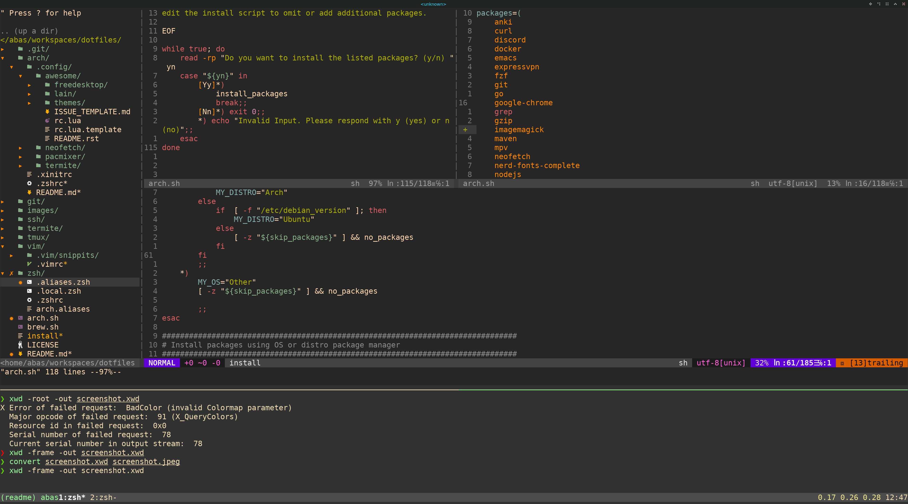
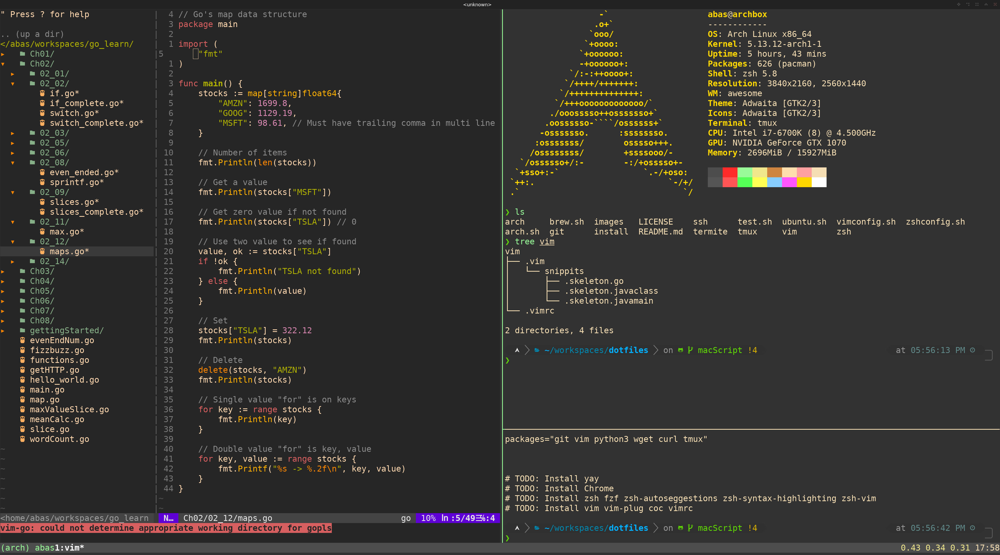

# Dot Files

#### Screenshot of Vim and TMUX setup


## Installation

To install paste the following on a macOS terminal or a shell prompt:
```bash
/bin/bash -c "$(curl -fsSL https://raw.githubusercontent.com/abasnfarah/dotfiles/main/install)"
```

This script installs the listed packages and creates symlinks for our dotfiles.

Compatable with macOS and Arch Linux.

### MacOS

This is the package list installed with Brew.
To change this list you can clone this repo and update `brew.sh` file.

```bash
packages=(
    bash 
    git 
    zsh 
    neofetch 
    tmux
    tree 
    coreutils
    zsh-syntax-highlighting 
    npm 
    mvn 
    yarn 
    go 
    python3 
    fzf 
    romkatv/powerlevel10k/powerlevel10k
)
```

This is the Cask list installed with Brew.
To change this list you can clone this repo and update `brew.sh` file.

```bash

CASKS=(
    adobe-creative-cloud
    alfred
    anki
    binance
    discord
    disk-inventory-x
    docker
    expressvpn
    firefox
    google-chrome
    intellij-idea-ce
    iterm2
    kindle
    lastpass
    minecraft
    notion
    obs
    postman
    postico
    slack
    spotify
    steam
    tor-browser
    virtualbox
    visual-studio-code
    vlc
    zoom
)
```

### Arch Linux

#### Screenshot of Vim and TMUX setup


##### PreInstall Arch Linux: 
For a guide to install Arch w/ UEFI go to [Arch Install Guide](https://github.com/abasnfarah/dotfiles/blob/main/arch/README.md)

##### Package List: 
This is the package list installed with yay.
To change this list you can clone this repo and update `arch.sh` file.
```bash
packages=(
    anki
    curl
    discord 
    docker
    emacs 
    expressvpn 
    fzf 
    git 
    go
    google-chrome 
    grep
    gzip 
    maven
    mpv
    neofetch 
    nerd-fonts-complete 
    nodejs 
    npm 
    nvm
    openssh 
    obs-studio
    python3 
    sed 
    slack-desktop
    smplayer
    spotify
    stow 
    termite
    termite-terminfo
    tree 
    tree 
    tmux
    unzip 
    vim
    wget
    xclip 
    yarn 
    zip 
    zoom
    zsh 
    zsh-syntax-highlighting 
    zsh-theme-powerlevel10k-git 
)
```

## Vim and TMUX config

#### Checkout my [.vimrc](https://github.com/abasnfarah/dotfiles/blob/main/vim/.vimrc)

My vim config uses the following plugins

```vim

" Completion handler
Plug 'neoclide/coc.nvim', {'branch': 'release'}
"Plug 'neoclide/coc.nvim', { 'branch': 'master', 'do': 'yarn install --frozen-lockfile' }

" Go plugin for vim development
Plug 'fatih/vim-go', { 'do': ':GoUpdateBinaries' }

" File tree 
Plug 'scrooloose/nerdtree'
Plug 'tiagofumo/vim-nerdtree-syntax-highlight'

" Markdown Preview
Plug 'iamcco/markdown-preview.nvim' 

" git integration
Plug 'Xuyuanp/nerdtree-git-plugin'
Plug 'airblade/vim-gitgutter'

" Themes and icons
Plug 'ryanoasis/vim-devicons'
Plug 'flazz/vim-colorschemes'
Plug 'vim-airline/vim-airline'
Plug 'vim-airline/vim-airline-themes'
Plug 'morhetz/gruvbox'
Plug 'HerringtonDarkholme/yats.vim' " TS Syntax
Plug 'sonph/onehalf', { 'rtp': 'vim' }
Plug 'vim-python/python-syntax'
Plug 'yuezk/vim-js'
Plug 'maxmellon/vim-jsx-pretty'
Plug 'styled-components/vim-styled-components', { 'branch': 'main' }
Plug 'jparise/vim-graphql'


" fuzzy file finder
Plug 'ctrlpvim/ctrlp.vim' 

" Commenter 
Plug 'preservim/nerdcommenter'

" JSX
"Plug 'prettier/vim-prettier', { 'do': 'yarn install' }

" Tmux and vim integration
Plug 'christoomey/vim-tmux-navigator'


```
